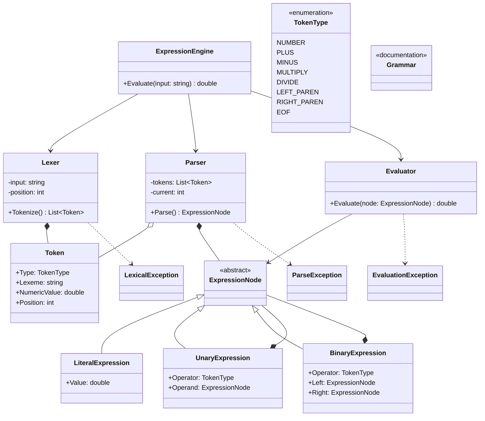

# ExpressionEngine

ExpressionEngine is a UI-agnostic, deterministic expression evaluation library.

It provides a clean and extensible pipeline to **parse**, **structure**, and **evaluate** arithmetic expressions. The library is designed as a minimal expression interpreter, suitable for calculators, rule engines, configuration evaluation, or as a learning/reference implementation of parsing theory.

The library deliberately avoids any frontend, UI, or framework dependency (including MAUI).

---

## Scope and Design Goals

**In scope**

* Arithmetic expression parsing
* Operator precedence and associativity
* Parentheses and nesting
* Unary and binary operators
* Abstract Syntax Tree (AST) construction
* Deterministic evaluation

**Out of scope**

* UI concerns (buttons, input handling, formatting)
* Floating UI state
* Localization or presentation
* Domain-specific math shortcuts

The library is intentionally structured to mirror classic language-processing pipelines.

---

## Conceptual Pipeline

ExpressionEngine follows a strict multi-stage evaluation pipeline:

```
Input string
   ↓
Lexical analysis (tokenization)
   ↓
Parsing (AST construction)
   ↓
Evaluation (tree walking)
   ↓
Result
```

Each stage is isolated and testable.

---

## Core Concepts

### Expressions

An expression is a construct that produces a value.

Examples:

* `3 + 4 * 2`
* `(1 + 2) * 3`
* `-5 + 8`

The engine is expression-only. Control flow and statements are intentionally excluded.

---

### Interpretation Model

ExpressionEngine is an **interpreter**, not a compiler.

* Expressions are parsed and evaluated immediately
* No intermediate bytecode or machine code is produced
* The same parsed structure may be re-evaluated

The architecture mirrors how interpreters and compilers structure frontends, but evaluation is performed via tree traversal.

---

## Architecture Overview

### 1. Lexing (Tokenization)

The lexer converts raw text into a sequence of tokens.

Responsibilities:

* Character scanning
* Number parsing
* Operator identification
* Parenthesis handling
* Whitespace elimination

Output:

```
NUMBER(3), PLUS, NUMBER(4), MULTIPLY, NUMBER(2)
```

---

### 2. Parsing

The parser transforms tokens into an Abstract Syntax Tree (AST).

Responsibilities:

* Operator precedence
* Associativity rules
* Unary vs binary operator resolution
* Parentheses grouping

Parsing is structural only. No evaluation occurs at this stage.

The recommended parsing strategy is **recursive-descent parsing**, with one method per grammar rule.

---

### 3. Abstract Syntax Tree (AST)

The AST represents the semantic structure of an expression.

Typical node types:

* LiteralExpression
* UnaryExpression
* BinaryExpression

Example:

```
   +
  / \
 3   *
    / \
   4   2
```

ASTs decouple syntax from execution and enable extensibility.

---

### 4. Evaluation

Evaluation is performed by recursively walking the AST.

Responsibilities:

* Evaluating child nodes
* Applying operator semantics
* Producing a final numeric result

Evaluation is deterministic and side-effect free.

---

## Public API Design

The public API is intentionally minimal.

Example usage:

```csharp
var engine = new ExpressionEngine();
var result = engine.Evaluate("3 + 4 * 2");
```

Design principles:

* Input is always a string
* Output is a value or a structured error
* Internal stages (lexer, parser, AST) may remain internal

---

## Error Handling

ExpressionEngine distinguishes between:

* Lexical errors (invalid characters)
* Syntax errors (invalid structure)
* Evaluation errors (division by zero, invalid operations)

Errors should be explicit and non-ambiguous.

---

## Project Structure

```
ExpressionEngine/
│
├── ExpressionEngine.cs          // Public API facade
│
├── Lexing/
│   ├── Token.cs
│   ├── TokenType.cs
│   └── Lexer.cs
│
├── Parsing/
│   ├── Parser.cs
│   └── Grammar.cs
│
├── Ast/
│   ├── ExpressionNode.cs
│   ├── LiteralExpression.cs
│   ├── UnaryExpression.cs
│   └── BinaryExpression.cs
│
├── Evaluation/
│   └── Evaluator.cs
│
└── Errors/
    ├── LexicalException.cs
    ├── ParseException.cs
    └── EvaluationException.cs
 


```

This structure enforces separation of concerns and mirrors standard compiler frontends.

