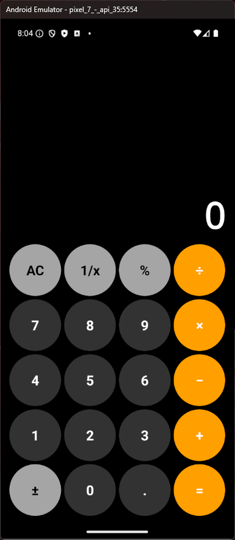
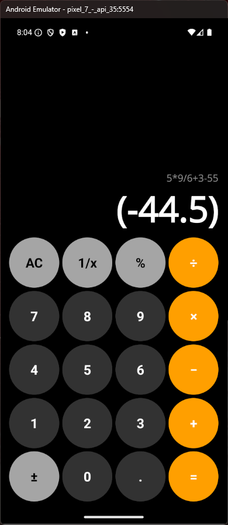
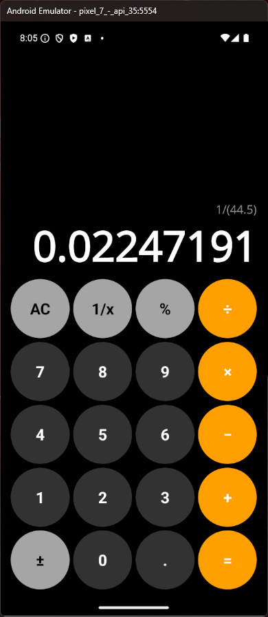
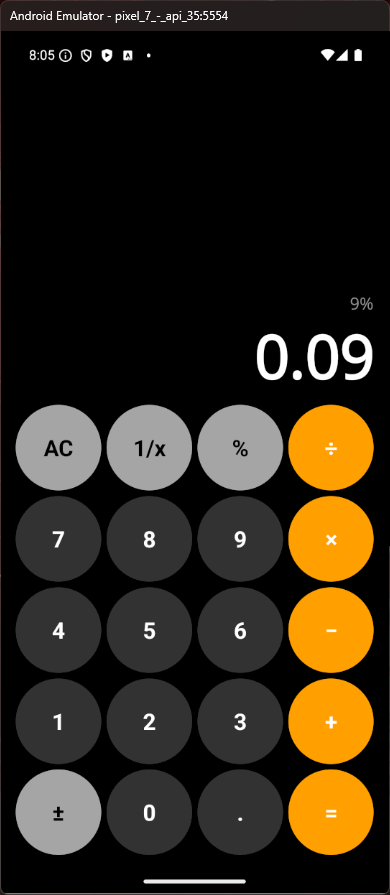
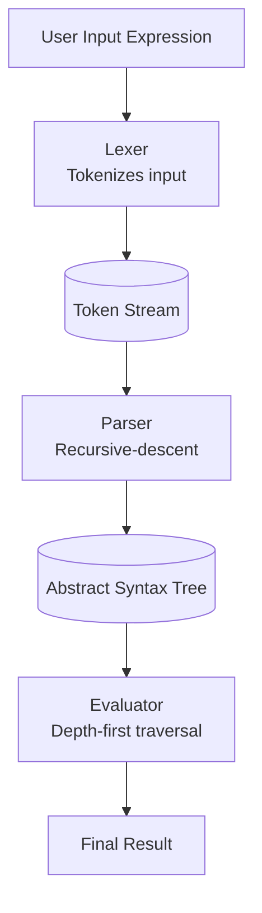
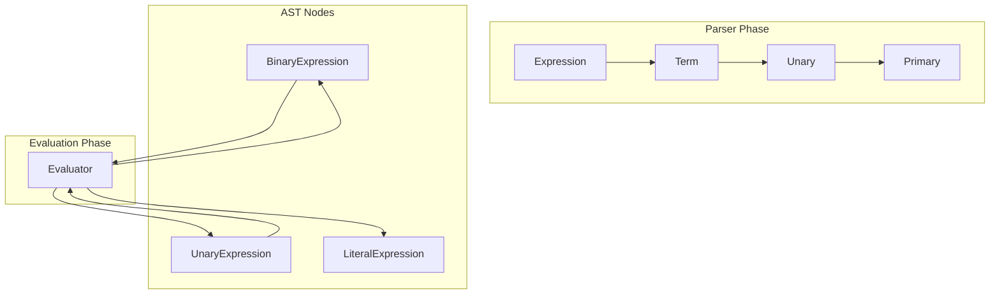

# Calculator (MAUI) — Compiler‑style Expression Engine

A modern calculator built with .NET MAUI powered by a custom expression engine designed using real compiler architecture principles.

This project is not a simple "eval" wrapper. It implements a full expression pipeline:

- Lexical analysis (tokenization)
- Recursive‑descent parsing
- Abstract Syntax Tree (AST) construction
- Tree‑based evaluation

This guarantees deterministic behavior, correct operator precedence, and extensibility.

------

# Screenshots







------

# Features

## Calculator Features

- Full arithmetic support
  - Addition (+)
  - Subtraction (−)
  - Multiplication (×)
  - Division (÷)
- Unary operations
  - Sign toggle (±)
  - Percent (%)
  - Inverse (1/x)
- Decimal number support
- Correct operator precedence
- Parentheses support via internal expression engine
- Expression history display
- Safe error handling
  - Division by zero
  - Invalid input
  - Parsing errors
- Deterministic evaluation (no floating operator ambiguity)

------

## Architectural Features

This calculator is powered by a true expression engine using compiler techniques.

Pipeline stages:

1. Lexer → converts input text into tokens
2. Parser → converts tokens into an Abstract Syntax Tree
3. Evaluator → recursively evaluates the AST

This ensures correctness, extensibility, and full control over evaluation behavior.

------

# Expression Engine Architecture

The engine follows the same architecture used by compilers.

```
Input Text
   │
   ▼
Lexer
   │
   ▼
Tokens
   │
   ▼
Parser
   │
   ▼
Abstract Syntax Tree (AST)
   │
   ▼
Evaluator
   │
   ▼
Result
```

------

# AST Tree Evaluation (Core Concept)

The parser builds a tree structure representing the expression.

Example:

```
3 + 4 * 2
```

Produces this AST:

```
      (+)
     /   \
   (3)   (*)
         / \
       (4) (2)
```

Evaluation happens bottom‑up.

```
4 * 2 = 8
3 + 8 = 11
```

This guarantees correct operator precedence automatically.

------

# Full Pipeline Diagram



------

# Tree Construction and Evaluation Flow



------

# Why AST‑based evaluation matters

This approach provides:

- Guaranteed operator precedence
- No ambiguous evaluation order
- Full control over behavior
- Extensibility for new operators
- Deterministic results

Unlike traditional calculators that evaluate left‑to‑right, this uses mathematical structure.

------

# Technologies

- .NET MAUI
- C#
- Custom Expression Engine

Components:

- Lexer
- Recursive‑descent Parser
- AST
- Evaluator

------

# Summary

This calculator demonstrates how compiler techniques can be applied to build a reliable and extensible expression evaluator.

The key innovation is the Abstract Syntax Tree, which ensures expressions are interpreted structurally rather than sequentially.

This mirrors real compiler behavior used in programming languages.
